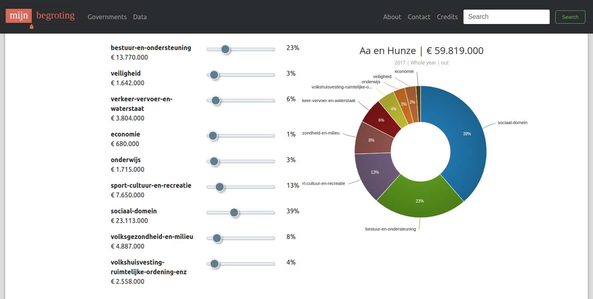

# Mijn Begroting

Personalized budgetering application for municipalities.

Uses the [Openspending API](http://openspending.nl/api/v1/doc/).

Choose the government (county) that you want to inspect.


The piechart displays the budget for a given year.



## Installation

```
$ git clone https://github.com/kgish/mijn-begroting.git
$ cd mijn-begroting.git
$ npm install
$ bower install
```


## Deploy

```
$ ember build --environment=production
$ sudo ln -s /path/to/mijn-begroting/dist /var/www/path/to/mijnbegroting.participation.tools
$ sudo chown -R www-data:www-dat /var/www/path/to/mijnbegroting.participation.tools
```

## CORS

Include the API hostname and COR details in the `config/environment.js` file:

```
module.exports = function(environment) {
  var ENV = {

    ...

    APP: {
      ...
    },

    apiHost: 'http://localhost:3000/api',

    contentSecurityPolicy: {
        'default-src': "'none'",
        'script-src': "'self'",
        'font-src': "'self'",
        'connect-src': "'self' http://localhost:3000/",
        'img-src': "'self'",
        'style-src': "'self'",
        'media-src': "'self'"
    }
  };

  ...

  return ENV;
};
```


## References

* [Socioneers](http://www.socioneers.com)
* [Openspending](http://www.openspending.nl)
* [Ember.js](http://www.emberjs.com)
* [Bootstrap](http://v4-alpha.getbootstrap.com)
* [Sass](http://sass-lang.com)
* [Fontawesome](http://fontawesome.io/icons)
* [D3.js](http://d3js.org)
* [D3pie.js](http://d3pie.org)
* [Emberx Range Input](http://github.com/thefrontside/emberx-range-input)


## Demo
    
For the time being, a demo of this website can be found here:

    http://mijnbegroting.participatie.tools/governments


## Author

Kiffin Gish  
Advanced Software Development for the Web  
[Gishtech](http://www.gishtech.com)
 
"You're never too old to learn new stuff..."

