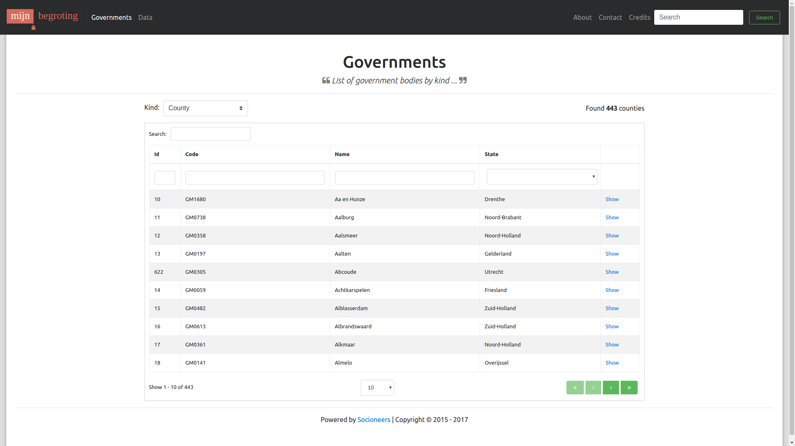

# Mijn Begroting

Personalized budgetering application for municipalities.

Uses the [Openspending API](http://openspending.nl/api/v1/doc/).




##

```
http://openspending.nl:80/api/v1/documents/?plan=budget&government__kind=county&government__name=Almelo&year=2016&period=0

```

## CORS

Include the API hostname and COR details in the `config/environment.js` file:

```
module.exports = function(environment) {
  var ENV = {

    ...

    APP: {
      ...
    },

    apiHost: 'http://localhost:3000/api',

    contentSecurityPolicy: {
        'default-src': "'none'",
        'script-src': "'self'",
        'font-src': "'self'",
        'connect-src': "'self' http://localhost:3000/",
        'img-src': "'self'",
        'style-src': "'self'",
        'media-src': "'self'"
    }
  };

  ...

  return ENV;
};
```


## Heroku

```
$ heroku create mijn-begroting
$ heroku buildpacks:add https://codon-buildpacks.s3.amazonaws.com/buildpacks/heroku/emberjs.tgz
$ git push heroku master
$ heroku open
```

## References

* [Openspending.nl](http://openspending.nl/)

